# ADF SAP ECC Adapter
The SAP ECC Adapter can be used to extract data from an SAP system using the oData protocol. So any object that can be exposed as an oData service can be used. For example :
* BAPI
* RFC
* SAP tables or Views
* Data Extractors
* HANA Tablesn, Views exposed via HANA XS

Note that this also means the Adapter is not limited to ECC also. For more info on the ECC Adapter see [Copy data from SAP ECC using Azure Data Factory](https://docs.microsoft.com/en-us/azure/data-factory/connector-sap-ecc)

In this example we'll extract product data. The system I'm using is a ABAP 7.5 SP2 - Developer Edition (which is running on Azure). 
Please have a look at [ABAP Developer Edition Installation Guide](https://blogs.sap.com/2016/11/03/sap-nw-as-abap-7.50-sp2-developer-edition-to-download-consise-installation-guide/) to get hold of the system.

This system contains an odata service which lists product data for a WebShop. The product data can be seen in a Fiori App at the following URL
https://vhcalnplci:44300/sap/bc/ui5_ui5/ui2/ushell/shells/abap/FioriLaunchpad.html#Shell-home. See the Manage Products app.
Note: 
* the URLs assume you've mapped the hostname of your SAP system to an IP address in your hosts file.
* the user needs the roles SAP_EPM_BCR_PURCHASER_T to see the Manage Products App. Use transaction su01 to assign these roles

The product data can be retrieved via http://vhcalnplci:8000/sap/opu/odata/sap/EPM_REF_APPS_PROD_MAN_SRV/Products. The meta data of the oData Service can be found at http://vhcalnplci:8000/sap/opu/odata/sap/EPM_REF_APPS_PROD_MAN_SRV/$metadata.

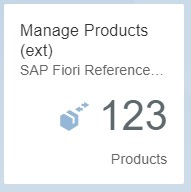

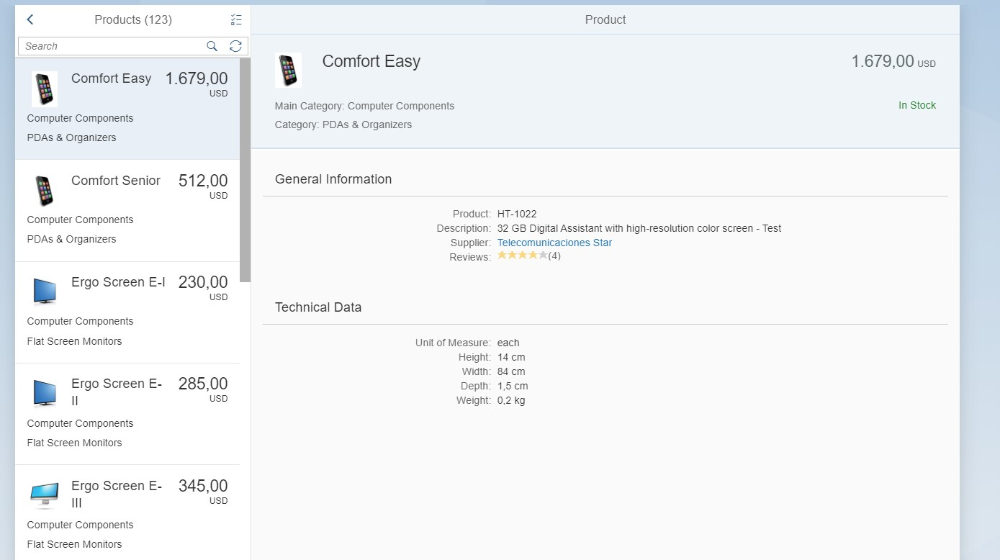

The target for the extraction will be a Azure SQL DataBase.

## Azure SQL DataBase Setup
First we must create an SQL DataBase and prepare it to receive the product data.
To create an Azure SQL Database, see xxxxxxxxx .
We need to create a table which will contain the product data. You can do this with the following SQL script
```SQL
create table NPLProducts (
    id nvarchar(25) not null,
    currencycode nvarchar(3),
    stockquantity int,
    name nvarchar(50),
    description text,
    subcategoryid nvarchar(50),
    subcategoryname nvarchar(50),
    maincategoryid nvarchar(50),
    maincategoryname nvarchar(50),
    supplierid nvarchar(50),
    suppliername nvarchar(50),
    lastmodified date,
    price decimal,
    quantityunit nvarchar(10),
    measureunit nvarchar(10),
    PRIMARY KEY (id)
);
```

The SQL Statements can be executed via the Qery Editor in the Azure Portal or via Azure Data Studio. For more info on Azure Data Studio, see What is Azure Data Studio https://docs.microsoft.com/en-us/sql/azure-data-studio/what-is.

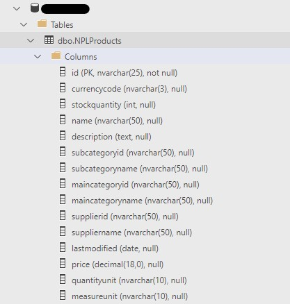

## Azure Data Factory Setup
### Define Connection
First you need to create a Data Factory. In this Data Factory, we'll need to create a connection to the SAP System using the SAP ECC Connector.
As url you'll need to use the base URL of the oData Service : http://x.x.x.x:8000/sap/opu/odata/sap/EPM_REF_APPS_PROD_MAN_SRV/.

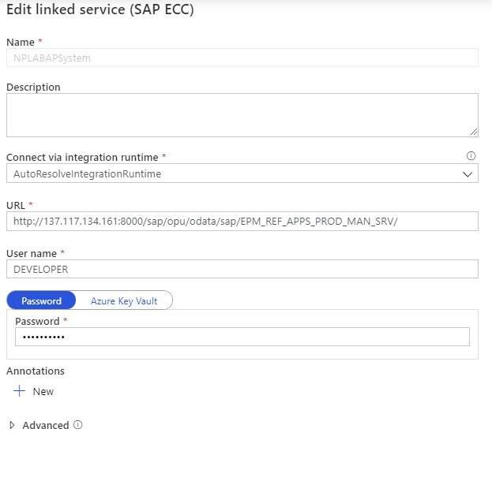

You'll also need to define a connection to the Azure SQL Database.

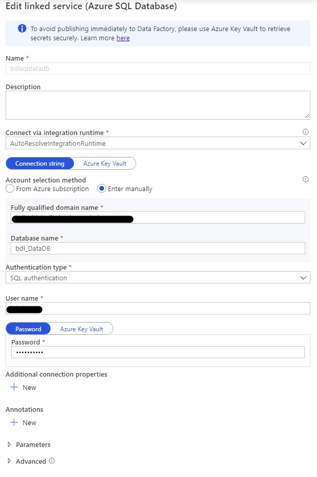

### Define DataSets
As a next step you need to define the DataSets.
For the SAP System.

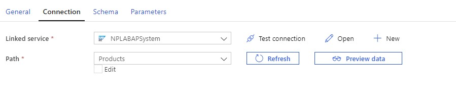

If the URL entered within the Connection is correct, ADF will display a dropdownlist of the EntitySets listed in the oData Metadata.

For the Azure SQL Database

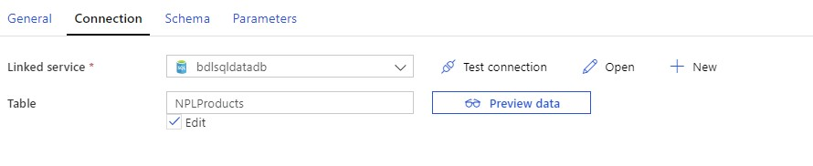

### Define Pipeline
As the last step we can define a pipeline to extract from SAP (source) to SQl Server (sink). For this we use the Copy Data Action.
As Source select the SAP Product DataSet and as sink the SQL Product DataSet. Also verify the mapping.

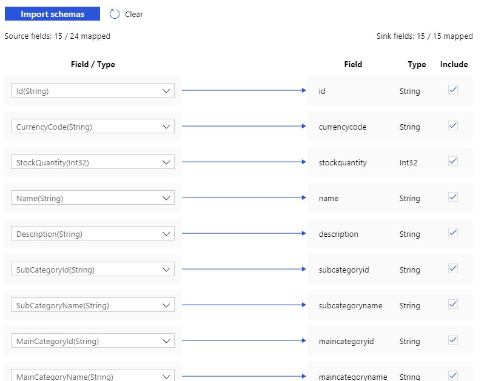

To test the Pipeline you can use 'Add Trigger > Trigger Now'. This will start the pipeline.

After a successfull run, you can use SQL to verify the result.
```SQL
SELECT * FROM [dbo].[NPLProducts]
```

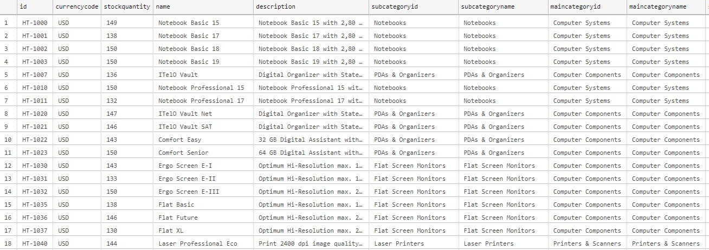

## Delta Updates
### Principle
The pipeline that we have now is fine for an initial download. But for future downloadswe would only like to synchronize the modified products.
For this we can use the lastModified field for the Products Entity set. We'll use this field as a filter in the oData query.
The oData URL would then look like this : http://vhcalplci:8000/sap/opu/odata/sap/EPM_REF_APPS_PROD_MAN_SRV/Products?$filter=LastModified%20gt%20datetime%272020-01-01T00:00:00%27.
To test the URL you can change a product via the Fiori App.

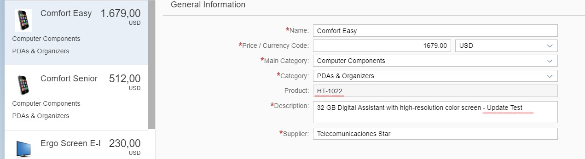

Result of the oData call :

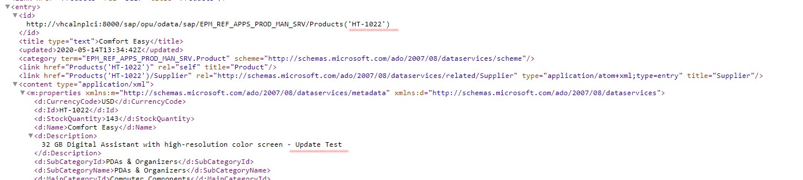

To keep track of the different delta, we need to keep track of the last date when a synchronization was done.
We'll save this date in a seperate table. The process flow is then as follows:
1. Retrieve the date of the last delta extraction
2. Use this date in the filter to extract the latest changes
3. Update the date of the last delta extraction

### Setup
#### Watermark Table
Create a new table to contain the last synchronization dates. 
```SQL
CREATE TABLE [dbo].[watermarktable](
	[TableName] [varchar](255) NULL,
	[WatermarkValue] [datetime] NULL
) ON [PRIMARY]
```
Note that I included a field TableName, this allows me to keep track of the delta sync per table (or per object if you want).

#### Initialize the watermark table.
INSERT INTO watermarktable values('NPLProducts', '2017-01-01T00:00:00.000');

#### Update Watermark procedure
We'll also need a procedure to update the watermark table

```SQL
CREATE PROCEDURE [dbo].[sp_write_watermark] @LastModifiedtime datetime, @TableName varchar(50)
AS

BEGIN

    UPDATE watermarktable
    SET [WatermarkValue] = @LastModifiedtime 
WHERE [TableName] = @TableName

END
```
#### Product Type Definition
```SQL
CREATE TYPE NPLProductsType As TABLE(
	id nvarchar(25) not null,
	currencycode nvarchar(3),
	stockquantity int,
	name nvarchar(50),
	description text,
	subcategoryid nvarchar(50),
	subcategoryname nvarchar(50),
	maincategoryid nvarchar(50),
	maincategoryname nvarchar(50),
	supplierid nvarchar(50),
	suppliername nvarchar(50),
	lastmodified date,
	price decimal,
	quantityunit nvarchar(10),
	measureunit nvarchar(10)
);
```
#### Insert or Update Product procedure
And a procedure to insert new products or update existing products.

```SQL
DROP PROCEDURE spOverwriteProducts

CREATE PROCEDURE spOverwriteProducts @Products [dbo].[NPLProductsType] READONLY
AS
BEGIN
  MERGE [dbo].[NPLProducts] AS target
  USING @Products AS source
  ON (target.id = source.id)
  WHEN MATCHED THEN
    UPDATE SET id = source.id,
				 currencycode  = source.currencycode,
				 stockquantity = source.stockquantity,
				 name = source.name,
				 description = source.description,
				 subcategoryid = source.subcategoryid,
				 subcategoryname = source.subcategoryname,
				 maincategoryid = source.maincategoryid,
				 maincategoryname = source.maincategoryname,
				 supplierid = source.supplierid,
				 suppliername = source.suppliername,
				 lastmodified = source.lastmodified,
				 price = source.price,
				 quantityunit = source.quantityunit,
				 measureunit = source.measureunit
  WHEN NOT MATCHED THEN
    INSERT (	
				id,
				currencycode,
				stockquantity,
				name,
				description,
				subcategoryid,
				subcategoryname,
				maincategoryid,
				maincategoryname,
				supplierid,
				suppliername,
				lastmodified,
				price,
				quantityunit,
				measureunit
			)
		VALUES (
				source.id,
				source.currencycode,
				source.stockquantity,
				source.name,
				source.description,
				source.subcategoryid,
				source.subcategoryname,
				source.maincategoryid,
				source.maincategoryname,
				source.supplierid,
				source.suppliername,
				source.lastmodified,
				source.price,
				source.quantityunit,
				source.measureunit
			);
END
```

A script to test the stored procedure:

```SQL
/*Test the stored procedure*/
Declare @ProductsList NPLProductsType
Insert @ProductsList ( id, currencycode, stockquantity, name, description, subcategoryid, subcategoryname, maincategoryid, maincategoryname, supplierid, suppliername, lastmodified, price, quantityunit, measureunit)
Values ('1- HT-Test', 'USD', 149, 'Test1 - Notebook Basic 15', 'Test Description 1', 'NoteBooks', 'Notebooks', 'ComputerSystems', 'ComputerSystems', '100000000', 'SAP', '2018-10-15T19:16:37.1892050', 956, 'EA', 'each' ),
       ('2- HT-Test', 'USD', 155, 'Test2 - Notebook Basic 15', 'test Description 2', 'NoteBooks', 'Notebooks', 'ComputerSystems', 'ComputerSystems', '100000000', 'SAP', '2018-10-15T19:16:37.1892050', 956, 'EA', 'each' );
	   
exec spOverWriteProducts @ProductsList;
select * from NPLProducts;
```
#### Update Pipeline
Now we can incorporate these elements into the pipeline.

We'll need some additional actions to retrieve and update the watermark.

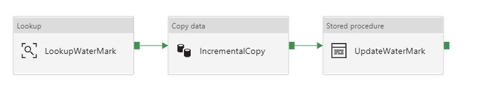

The first step is a lookup to retrieve the last delta date. You'll also need to create a DataSet for the watermark table. Since I'm using the same Azure SQL Database I can reuse my connection to this database.


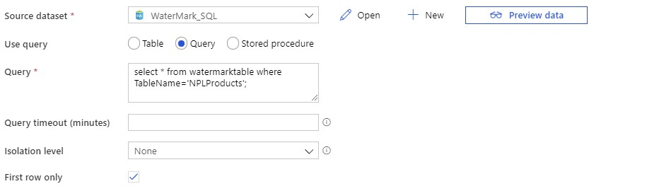

In the copy step we need to update the source to include the date filter. In the sink we need to execute to stored procedure to update the products.
In the Query parameter of the Source add : 

```Javascript
$filter=LastModified%20gt%20datetime%27@{activity('LookupWaterMark').output.firstRow.WaterMarkValue}%27
```

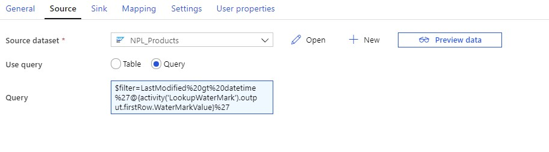

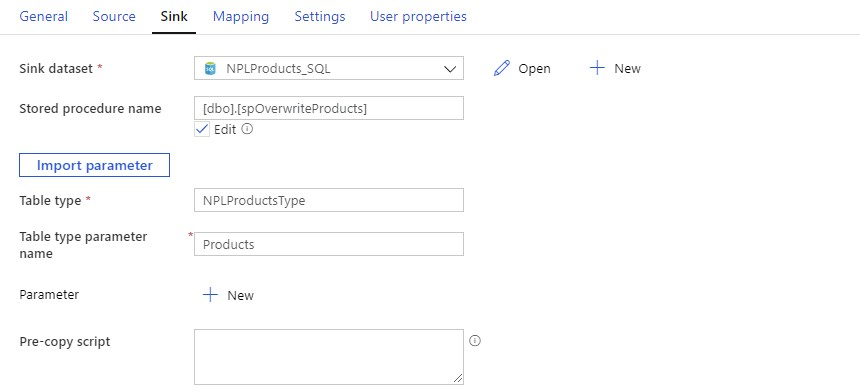

In the last action we need to update the watermark table.


#### Testing
You can now test the pipeline. On the first run, you will do an initial download once more. (Depending on how you initialized the watermark table).
Future runs should only download deltas.

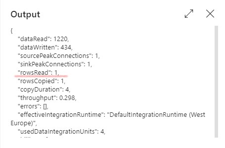

```SQL
SELECT [ID], [description] FROM [dbo].[NPLProducts] WHERE ID='HT-1022';
```

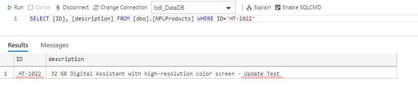

# Disclaimer :
This code example describes the principle, the code is not for production usage.


