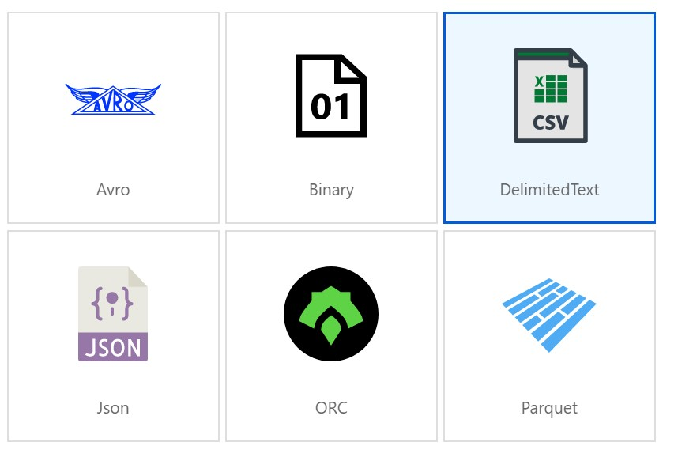

# ADF SAP ECC Adapter - Azure Data Lake

In this example we will use the ECC Adapter to extract SAP data towards an Azure Data Lake.
We'll use a similar setup as in the previous example.

## Setup
Compared to the previos example we need to create a connection to the data lake and a corresponding data set.

### Azure Data Lake
First we need to create a Azure Data Lake Storage Gen2. For this we need to create a storage account.

See [Create an Azure Storage account](https://docs.microsoft.com/en-us/azure/storage/common/storage-account-create?toc=%2Fazure%2Fstorage%2Fblobs%2Ftoc.json&tabs=azure-portal).


Make sure to enable hierarchical namespaces in the Advanced Tab.


The deployment will take a couple of minutes.
Using [Azure Storage Explorer](https://azure.microsoft.com/en-us/features/storage-explorer/), we can define a Blob container and a File Path.


### Connection
Next we need to create a connection to the newly created Azure Data Lake.


### DataSet
We'll need to create a DataSet for our products using our previously defined connection.
Choose Azure Data Lake Storage Gen2 and as format I chose Delimited Text (csv). Feel free to experiment with other data formats (see also the Appendix beneath).




Check 'First Row as Header' if you want your csv to have a header line with column labels.

### Pipeline
In the pipeline we use the Copy action as in the previous example. 


The source is linked to the productEntitySet.


The sink is linked to the products directory in the data lake storage.


After publishing, we can test the pipeline.
Upon successfull completion of the pipeline run, a products.csv file will appear in the file directory.


You can use Excell to view the data.
Open Excell and use the import data from csv/txt file to see the product data.


## FileName
Each time the pipeline is executed the products csv file is overwritten. You can prevent this by introducing variables with the file name in the DataSet. You can for example make use of a timestamp within filename.

```javascript
@concat('products_', formatDateTime(utcnow(),'yyyy-MM-dd-hhmmss'),'.csv')
```


## Updates
To extract deltas, we'll use the same principle as in the previous example.
1. Retrieve the date of the last delta extraction
2. Use this date in the filter to extract the latest changes
3. Update the date of the last delta extraction

The deltas will now be saved in a different file.
First we need to initialize our watermark table.

```SQL
INSERT INTO watermarktable values('NPLProductsDL','2017-01-01T00:00:00.000');
```
Note: to distinguish with the [ECC-SQL server example](SAPECCAdapter.md) I'm using a different table (or object :) ) name.

Our pipeline looks as follows :


The SQL Query in the lookup actions is now as follows :
```SQL
select * from watermarktable where TableName='NPLProductsDL';
```


The source of the copy action


The sink of the copy action


The stored procedure from the [ECC-SQL server example](SAPECCAdapter.md) to update the watermark can be reused.
Use the import parameter button to retrieve the parameters from the stored procedure.


You can now test the pipeline.
Depending on the initialization of the watermark table an initial download is done. Afterwards you can update the product via the fiori app [Manage Products](http://vhcalplci:8000/sap/opu/odata/sap/EPM_REF_APPS_PROD_MAN_SRV/Products?$filter=LastModified%20gt%20datetime%272020-01-01T00:00:00%27).
A next run of the pipeline will just retrieve the updated product and put this in a seperate xls file.


Also the watermark table is updated to the timestamp of the last pipeline run.

------------------------------------------------
ToDo:
- [ ] Merge the CSV / JSON / Parquet files
- [ ] Template for updates
------------------------------------------------

# Appendix
## Extract to JSON Format
For this we need to use the JSON format in the definition of the DataSet and use this dataset in the copy pipeline.


### JSON DataSet definition


### JSON Copy Sink definition
Use the JSON Dataset in the sink tab of the copy pipeline.


Here you can choose the export as a Set of JSON Objects or as an Array of JSON Objects.

#### Set of JSON Objects


#### Array of JSON Objects


## Extract to Parquet format
For this we need to use the Parquet format in the definition of the DataSet and use this dataset in the copy pipeline.


### Parquet DataSet Definition


### Parquet Copy Sink definition


