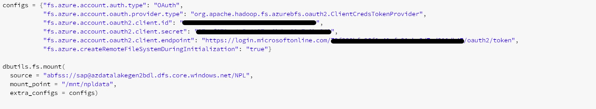
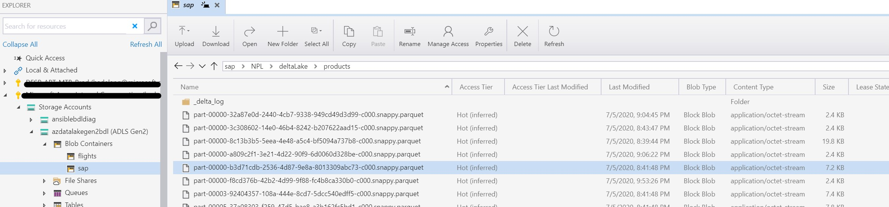
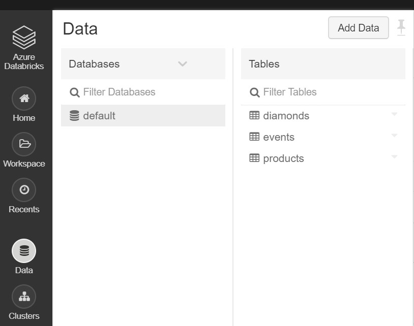
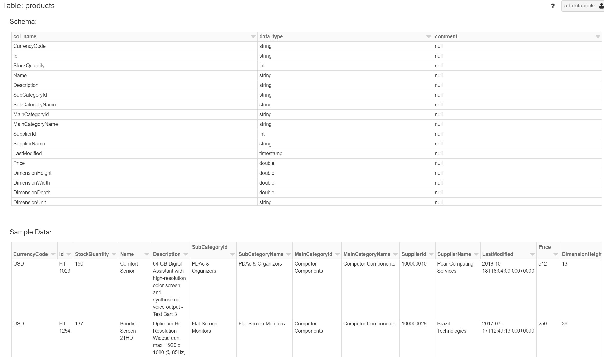
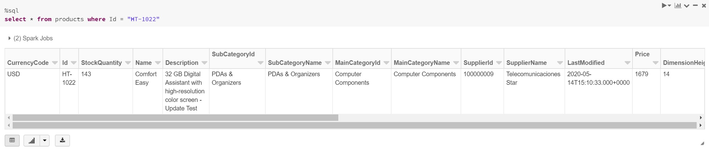
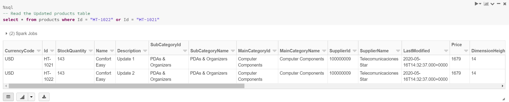

# ADF SAP ECC Adapter - Azure Data Lake - Delta Handling

[Part 1 - ECC Adapter & DataLake](SAPECC_DataLake.md) describes how the ECC adapter can be used to download ECC data to Azure data lake folders.\
[Part 2 - Delta Handling](SAPECC_DataLake2.md) describes the tooling to upload an initial download into a delta table and to merge delta changes into the delta table.\
[Part 3 - Azure Data Factory Integration](SAPECC_DataLake3.md) describes how to integrate the tools from Part 2 into Azure Data Factory.\

## Process
A possible way for delta handling is as follows:
* The Initial download of the data is saved within Azure DataLake
* This Initial download is used to fill a delta table using DataBricks
* Delta changes are then merged with Delta Table using DataBricks

# Azure Data Lake and Azure DataBricks SetUp
## DataBricks Setup
First we need to create a DataBricks workspace and a cluster.
* [Create a DataBricks Workspace](https://docs.microsoft.com/en-us/azure/databricks/scenarios/quickstart-create-databricks-workspace-portal?tabs=azure-portal#create-an-azure-databricks-workspace).
* [Create Cluster](https://docs.microsoft.com/en-us/azure/databricks/scenarios/quickstart-create-databricks-workspace-portal?tabs=azure-portal#create-a-spark-cluster-in-databricks).

## Service Principal creation
There are four ways of accessing Azure Data Lake Storage Gen2:
* Pass your Azure Active Directory credentials, also known as credential passthrough.
* Mount an Azure Data Lake Storage Gen2 filesystem to DBFS using a service principal and OAuth 2.0.
* Use a service principal directly.
* Use the Azure Data Lake Storage Gen2 storage account access key directly.

 See [Azure Data Lake Gen2](https://docs.microsoft.com/en-us/azure/databricks/data/data-sources/azure/azure-datalake-gen2).

This document describes the use a service principal.

To create the service principal using Azure CLI :
```ps1
az ad sp create-for-rbac --name <spName>

```
This will provide a json document from which you'll need the `appId`, `tenantID` and `secret` later on to mount the datalake filesystem in DataBricks./

Upon successfull creation, the service principal can be found under App Registrations in your Azure Active Directory.


Assign the role 'Storage Blob Data Contributor' on the Azure Data Lake Storage Gen2 account.


## Mount the Azure Data Lake Directory
The Azure Data Lake Directory where ADF puts the csv files is mounted using a Notebook.
Use the following command in Python.

```python
configs = {"fs.azure.account.auth.type": "OAuth",
        "fs.azure.account.oauth.provider.type": "org.apache.hadoop.fs.azurebfs.oauth2.ClientCredsTokenProvider",
        "fs.azure.account.oauth2.client.id": "<appId>",
        "fs.azure.account.oauth2.client.secret": "<clientSecret>",
        "fs.azure.account.oauth2.client.endpoint": "https://login.microsoftonline.com/<tenant>/oauth2/token",
        "fs.azure.createRemoteFileSystemDuringInitialization": "true"}

dbutils.fs.mount(
    source = "abfss://<container-name>@<storage-account-name>.dfs.core.windows.net/<directory-name>",
    mount_point = "/mnt/<mountpoint>",
    extra_configs = configs)
```
For our products example :
* Directory Name : NPL
* Mount Point : npldata



## Create Delta Table
The products data can now we imported into a Delta Lake table.
(Suppose the initial download of the product data was saved in directory ´../NPL/products.csv´ on Azure Data Lake. Using the cluster mountpoint this corresponds to ´/mnt/npldata/products.csv´.

```python
# Use the previously established DBFS mount point to read the data.
# create a data frame to read data
productsDF = spark.read.format('csv').options(
    header='true', inferschema='true').load("/mnt/npldata/products.csv")

#Convert to Delta table
productsDF.write.format("delta").save("/mnt/npldata/deltaLake/products")
```

You can use the Azure Storage Explorer to have a look at the delta table.



To be able to query the products data, you need to create a table.

```sql
%sql
CREATE TABLE products
USING delta
LOCATION '/mnt/npldata/deltaLake/products'; 
```

The products table now shows up in the cluster data.



When selecting the products table, you can see the schema and sample data.



You can now query the table using sql.
```sql
%sql
select * from products where Id = "HT-1022"
```



## Delta Handling
The advantage of using a Delta Table is that we can easily upsert the delta changes.
Suppose the delta changes are saved as csv files. These csv files can be read into a DataFrame. This DateFrame is then converted into a temporary table which can be used for merging.

### Read the csv files
```python
#Read all the csv files
productsNewDF = spark.read.format('csv').options(
    header='true', inferschema='true').load("/mnt/npldata/*.csv")

#Convert to Temporary table
productsNewDF.createOrReplaceTempView("newProducts")
```

This temporary table `newProducts` can also be queried.


### Execute the merge
```sql
%sql
-- Merge
MERGE INTO products
USING newProducts
ON products.Id = newProducts.Id
  WHEN MATCHED THEN UPDATE SET *
  WHEN NOT MATCHED THEN INSERT *
```

Afterwards you can query the results of the merge.



<!--  Tutorial : https://docs.microsoft.com/en-us/azure/storage/blobs/data-lake-storage-use-databricks-spark -->

## Next Steps
[Part 3 - Azure Data Factory Integration](SAPECC_DataLake3.md) describes how these tools can be integrated within an Azure Data Factory Pipeline.

## Documentation
* [Azure DataBricks Documentation](https://docs.microsoft.com/en-us/azure/databricks/)
* [Azure Data Lake Gen2](https://docs.microsoft.com/en-us/azure/databricks/data/data-sources/azure/azure-datalake-gen2)
* [Delta Lake](https://docs.microsoft.com/en-us/azure/databricks/delta/)

## Disclaimer
This code example describes the principle, the code is not for production usage.
