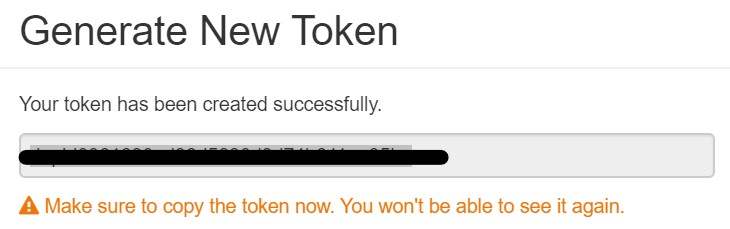
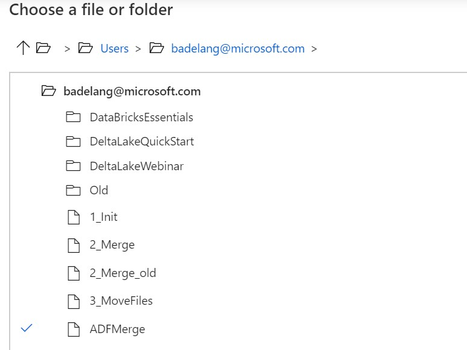

# ADF SAP ECC Adapter - Azure Data Lake - Data Factory Integration

## Overview
[Part 1 - ECC Adapter & DataLake](SAPECC_DataLake.md) describes how the ECC adapter can be used to download ECC data to Azure data lake folders.\
[Part 2 - Delta Handling](SAPECC_DataLake2.md) describes the tooling to upload an initial download into a delta table and to merge delta changes into the delta table.\
[Part 3 - Azure Data Factory Integration](SAPECC_DataLake3.md) describes how to integrate the tools from Part 2 into Azure Data Factory.\

This part will integrate the delta handling into an Azure DataLake pipeline.

## SetUp
In a first step the DataFactory needs a connection to DataBricks.

### Access Token
DataFactory needs an access token to access DataBricks. This token is generated from the DataBricks Workspace.
See [Generate a personal access token](https://docs.databricks.com/dev-tools/api/latest/authentication.html#generate-token).

Within the DataBricks Workspace, choose `user settings` and go to `Access Tokens`.

\
\

Generate a new token. Leave the lifetime empty so the token lives indefinetly.

Make sure to copy the generated token. You won't be able to access it again.

\
\
\

### DataBricks Linked Service
You can now create a linked service for DataBricks.

In DataFactory, choose connections.

Next create a new linked service. Select `compute`, followed by `Azure DataBricks`.

\

Enter the settings for the DataBricks service :
* enter a name for the linked service
* choose your Azure Subscription
* use the access token generated above
* select your DataBricks workspace
* select existing interactive cluster. Make sure the cluster is running. 
* select your cluster

Test the connection.

Note : the `existing cluster` is the cluster where the DataLake filesystem is mounted and where the `products`table is loaded. If you would choose `new cluster`, then each time the pipeline is run a new cluster is created. You would then need to mount the filesystem and load the `products`table from storage.

## Data Factory Pipeline
Now you can create the data factory pipeline.

Insert a DataBricks notebook activity.

Link the activity to the DataBricks Linked Service.

Select the path to your notebook.

Save and publish the pipeline.
Put some csv files with product updates in your source directory and trigger the pipeline.
Use the monitor tool to examine the progress.

>Note: when an error occurs ADF provides a link to the databricks log of your pipeline run.
>
>\
>\
>\

Upon successfull completion of the pipeline run, you can use sql to query the results and verify if the csv files are moved to the processed folder.

#### SQL Query

#### Processed Folder

As a last step you can combine this pipeline with the pipeline created in [Part 2 - Delta Handling](SAPECC_DataLake2.md) to have the complete process in one pipeline.

#### Complete Pipeline

## Documentation
* [Run a Databricks notebook with the Databricks Notebook Activity in Azure Data Factory](https://docs.microsoft.com/en-us/azure/data-factory/transform-data-using-databricks-notebook)

## Disclaimer
This code example describes the principle, the code is not for production usage.

