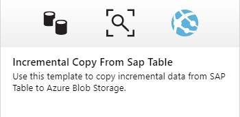

# SAP Table Connector

This document describes how to extract data from SAP using the Table Connector.
The table connector executes a RFC call to retrieve data from SAP Tables. The RFC function is `/SAPDS/RFC_READ_TABLE2`. 
In this example we'll retrieve product data from table `SEPMRACPOPDVH`.

## Setup
### ADF Runtime Integration Engine
Since the Table connector uses RFC we need to install a Runtime Integration Engine with the SAP .Net Connector.
I installed this on a azure vm.

In Azure DataFactory, you need to define a self-hosted Runtime Integration Engine.
This is done in the connections section.


#### Self Hosted Runtime


During this definition, you will receive authentication keys.


You'll need these authentication keys during the installation of the Runtime Integration Engine.

\
\


Once this is done, the RTI will also show up as running in Azure Data Factory.


### SAP Connector
To be able to execute RFC calls you need to install the SAP .Net Connector on the Runtime Integration Engine.


## Data Factory Pipeline Setup

## SAP Table Connector
As usual you start with creating a linked Service for the SAP Table Connector. This service is linked to you SAP system.

\
\


This is then followed by the DataSet definition. Here you indicate from which table you want to extract data.


Finally you implement the pipeline using a copy action.

The source is our Table DataSet and the sink in this example is Azure Data lake.

#### Source


#### Sink


You can now trigger the pipeline.

In case you run into errors, you can always use the FunctionBuilder (transaction se37) within SAPGui to test the input parameters.
This is especially usefull if you start adding parameters to select data.

## Delta Handling
The delta handling follows the same principle as the other examples.
* Read the watermark table
* Extract the changed data based on the LASTMODIFIED date field and the watermark
* Update the watermark

### WaterMark table
First the watermark needs to be initialized.

```SQL
INSERT INTO watermarktable values('NPLProductsTable','2017-01-01T00:00:00.000');
```
Note: to distinguish with the [ECC-SQL server example](SAPECCAdapter.md) and other examples, I'm using a different table (or object :) ) name.

The complete pipeline looks similar to the other examples :


The SQL Query in the lookup action is now as follows :
```SQL
select * from watermarktable where TableName='NPLProductsTable';
```

To select the changes since the last sync we need to enter a filter statement in the source of the copy action.

```javascript
@{concat('LASTMODIFIED GE ', formatDateTime(activity('LookupWaterMark').output.firstRow.WatermarkValue, 'yyyyMMdd'))}
```

In the `Update Watermark` activity set the `table` parameter to ``NPLProductsTable` Action.


## ADF Template
A other elaborate example of using the table connector can be found in the ADF Templates.

\
\
\

## Documentation
* [SAP Table Connector Documentation](https://docs.microsoft.com/en-us/azure/data-factory/connector-sap-table)

<!--
## ToDo
* table list automation
* sequencing
-->